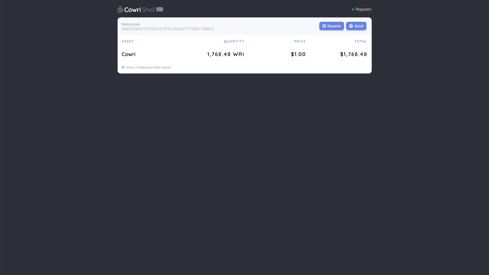

# project-x
## What is project-x?
 > stablecoin shell protocol
 
 
 
## Table of Contents

* [project-x](#project-x)
* [Description](#description)
* [Technology Stack](#technology-stack)
* [Installation](#installation)

## Description 

TODO

## Technology Stack

 * JavaScript
 * NodeJS/Express
 * 0x
 * React
 * Solidity
 * Web3

## Installation

#### Clone project
Clone repo from github:
```sh
# run git clone
git clone https://github.com/cowri/project-x.git
```

#### Project dependencies

Install [MetaMask](https://chrome.google.com/webstore/detail/metamask/nkbihfbeogaeaoehlefnkodbefgpgknn "MetaMask Chrome Extension]") Chrome Extension:
> MetaMask is an extension for accessing Ethereum enabled Dapps in Chrome

Install project dependencies:
```sh
# run install script
yarn install
```

## Operation

#### Local development

Start server:
```sh
# run start script
yarn start
```
